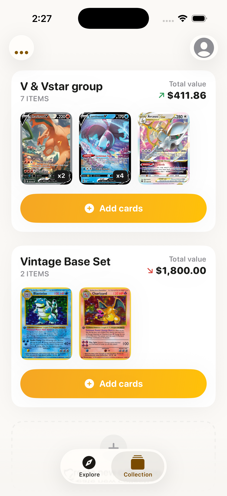
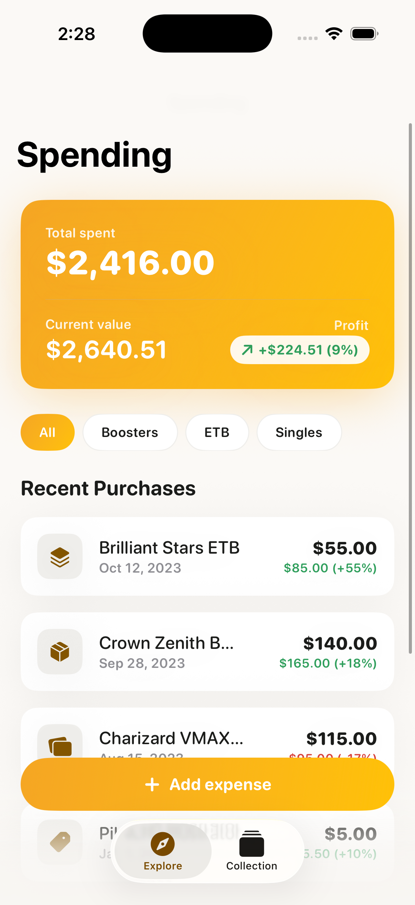

# Pokedesk 🃏

A native iOS app to **track your Pokémon card collection, its live market value, and how much you've spent vs. how much it's worth** (profit tracking).

Built with **SwiftUI + SwiftData**, prices powered by the free [Pokémon TCG API](https://pokemontcg.io).

---

## Features

| Area | What it does |
|------|--------------|
| 📚 **Collections** | Group your cards into named collections (e.g. "V & Vstar group"). See item count and total value at a glance. |
| ➕ **Add cards** | Search any card by name via the Pokémon TCG API, then save it with a quantity and the price you paid. |
| 📈 **Live value** | Each card shows its current market price, a trend chart (7D / 1M / 3M / 6M), and marketplace listings. Pull to refresh prices. |
| 💸 **Spending & profit** | Log sealed-product purchases (boosters, ETBs, singles). The dashboard shows **Total spent → Current value → Profit** across everything you own. |

> The app ships with **demo data** on first launch so it looks populated immediately. Delete the app from the simulator/device to start fresh.

---

## Screenshots

| Collection home | Spending & profit |
|---|---|
|  |  |
| Collection cards with quantity badges, total value, and per-collection previews. | Amber summary card (spent / value / profit) + categorized purchase list. |

> Reference mockups live in [`stitch_pokedesk_card_value_tracker/`](stitch_pokedesk_card_value_tracker/) (generated with Google Stitch). The design system is documented in that folder's `DESIGN.md`.

---

## Requirements

- **Xcode 16+** (developed on Xcode 26.5)
- **iOS 17.0+** deployment target
- macOS with the iOS Simulator, or a physical device

No third-party dependencies — everything uses Apple frameworks (SwiftUI, SwiftData, Swift Charts).

---

## Getting started

```bash
git clone <your-repo-url>
cd PokemonApp
open Pokedesk.xcodeproj
```

Then in Xcode: select an iPhone simulator and press **⌘R**.

Or build from the command line:

```bash
xcodebuild -project Pokedesk.xcodeproj -scheme Pokedesk \
  -destination 'generic/platform=iOS Simulator' build
```

### Optional: Pokémon TCG API key

The app works without a key (anonymous quota). For higher rate limits, get a free key at
[dev.pokemontcg.io](https://dev.pokemontcg.io) and set it in
[`Pokedesk/App/AppConfig.swift`](Pokedesk/App/AppConfig.swift):

```swift
static let pokemonAPIKey: String? = "your-key-here"
```

> ⚠️ Don't commit a real key. Consider moving it to a gitignored `Secrets.swift` before going public.

---

## Project structure

```
Pokedesk/
├── App/              App entry point, root tab navigation, config
├── DesignSystem/     Colors, typography, spacing + reusable components
├── Models/           SwiftData models (CardCollection, OwnedCard, Expense, PriceSnapshot)
├── Services/         Pokémon TCG API client, price refresh, demo data
├── Features/
│   ├── Collections/  Home, collection detail, create/edit form
│   ├── AddCard/      Card search + "Add to collection" sheet
│   ├── CardDetail/   Live value, trend chart, details, listings
│   └── Spending/     Profit dashboard + add-expense form
└── Assets.xcassets/  App icon, accent color
```

See [ARCHITECTURE.md](ARCHITECTURE.md) for the full breakdown (data model, services, design tokens).

---

## Roadmap

See [ROADMAP.md](ROADMAP.md). Highlights still to do:

- "Pick collections" screen (add a card to multiple collections at once)
- Active "Add to collections" action from the card detail screen
- App icon
- iCloud sync (CloudKit)

---

## License

See [LICENSE](LICENSE).

---

*Pokémon and Pokémon card images are © Nintendo / Creatures Inc. / GAME FREAK inc. This is a personal, non-commercial collection-tracking tool.*
